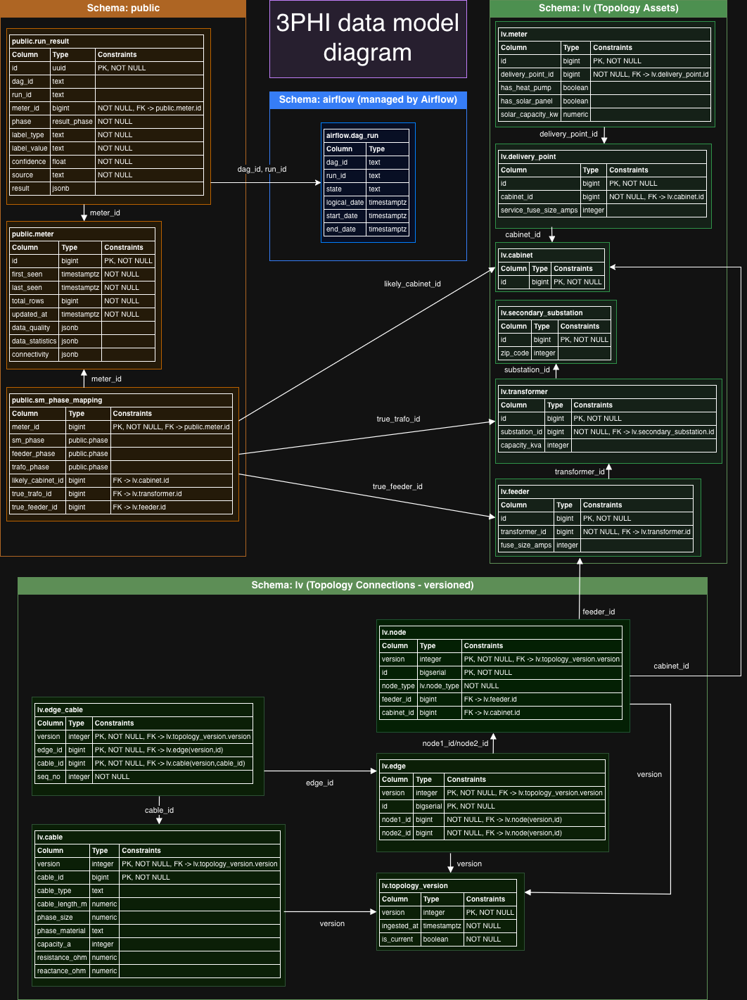

# 3phi Framework

Utility classes for **DB** access, **S3** interactions, and **data processing** via Controller Classes.  
Distributed on PyPi.

> **Install name:** `3phi-framework`  
> **Import package:** `threephi_framework`  
> **Used by:** [3-Phase-Insight Data Platform](https://github.com/3PhaseInsight/data-platform)

---

## Installation

### Install from PyPi

```
pip install 3phi-framework
```

### Installing a Development Build (from CI)

Development builds are generated for each pull request and attached as workflow artifacts.
#### Download the artifact

1. Open the pull request on GitHub
2. Go to the Checks tab
3. Open the CI and Release workflow run
4. Download the artifact named dist-pr
5. Extract the archive locally

It will contain files like:

dist/
  3phi_framework-<version>.whl
  3phi_framework-<version>.tar.gz

#### Install the wheel (recommended)

From the extracted directory:
```
pip install dist/3phi_framework-*.whl
```

Alternatively, install the source distribution:
```
pip install dist/3phi_framework-*.tar.gz
```

Notes:
Wheels are preferred and install faster.
Make sure you are using Python ≥ 3.12 (project requirement).
Dev builds are temporary and may be deleted after 7 days.

## Quickstart

The framework is set up for local development as well as for being used in a deployment.
To set up your environment for local development, follow these steps:

### Set up virtual environment

[execute_data_app.sh](execute_data_app.sh) expects a virtual environment to be set up under [.venv]. See the [python docs](https://docs.python.org/3/library/venv.html) on how to set it up.

### Seed data (optional)

The database **schema** is provisioned automatically from the canonical sqitch migrations, so you do
not need to supply it. Seed *data* is optional:
- Database: place a data-only dump at [docker/db/seed/seed.sql](docker/db/seed/seed.sql) (gitignored). See [docker/db/seed/README.md](docker/db/seed/README.md) for how to generate it; it is loaded by `make up-seeded`.
- Object storage: copy a bucket from a working object storage to [3phi](docker/object_storage/3phi); it is mounted as a MinIO bucket.

### Spin up DB and Object Storage

Navigate to [docker](./docker) and run
```
make up          # schema only (empty tables)
make up-seeded   # schema + load docker/db/seed/seed.sql if present
```

This brings up a local Postgres (schema deployed from the canonical sqitch migrations) and a MinIO
Object Storage. See [docker/README.md](docker/README.md) for details.

### Run a data app locally

Use the utility script [execute_data_app.sh](execute_data_app.sh) and pass the data app name as an argument, e.g.:
```
./execute_data_app.sh sm_classifier
```
In case the script is not executable, make it executable:
```
chmod +x execute_data_app.sh
```

The script will install the dependencies in [requirements.txt](requirements.txt) in your virtual environment, set up environment variables as they are listed in [.env](.env) and execute the data app as a python module.

## Object Storage Connectors

The framework abstracts object storage behind `BaseConnector` so data apps are decoupled from the underlying storage backend. Two implementations are provided out of the box.

### Choosing the backend

Every data app works against a single connector, resolved in this order:

1. **Dependency injection** — pass any `BaseConnector` instance to the data app:
   ```python
   from threephi_framework import AzureBlobConnector, SMClassifier

   connector = AzureBlobConnector(data_dir_path="phase_measurements/raw")
   with SMClassifier(config, connector=connector) as app:
       app.run()
   ```
2. **Config key** — set `object_storage_backend: "s3" | "azure"` in the data app config (e.g. in a DAG's YAML); the connector is built by `create_connector()`.
3. **Environment variable** — `OBJECT_STORAGE_BACKEND` (same values), useful to switch a whole deployment.
4. **Default** — `"s3"`.

The connector is rooted at `config["data_dir_path"]` (default `phase_measurements/raw`) and shared by the data app's `DataExtractor` and `TimeSeriesController`. Functions that run on Dask workers reconstruct the connector from the backend name carried in their config, so backends swap consistently across the cluster.

### S3Connector

For AWS S3 or any S3-compatible storage (the default local dev setup uses **MinIO**).

```python
from threephi_framework import S3Connector

connector = S3Connector(data_dir_path="timeseries/ready")
```

| Environment variable | Required | Description |
|---|---|---|
| `S3_ENDPOINT_URL` | Yes | Full URL of the S3 endpoint, e.g. `http://localhost:19000` for MinIO |
| `S3_ACCESS_KEY` | Yes | Access key / username |
| `S3_SECRET_KEY` | Yes | Secret key / password |

The bucket name is fixed to `3phi`. All paths are rooted at `s3://3phi/<data_dir_path>`.

### AzureBlobConnector

For **Azure Blob Storage**. Requires the `adlfs` package (`pip install adlfs`).

```python
from threephi_framework import AzureBlobConnector

connector = AzureBlobConnector(data_dir_path="timeseries/ready")
```

| Environment variable | Required | Description |
|---|---|---|
| `AZURE_STORAGE_ACCOUNT_NAME` | Yes | Azure Storage Account name |
| `AZURE_STORAGE_CONTAINER_NAME` | Yes | Blob container name (equivalent to the S3 bucket) |
| `AZURE_STORAGE_ACCOUNT_KEY` | No | Account key for key-based auth. If omitted, `DefaultAzureCredential` is used automatically |

All paths are rooted at `az://<container>/<data_dir_path>`.

**Authentication** — when `AZURE_STORAGE_ACCOUNT_KEY` is not set, the connector falls back to [`DefaultAzureCredential`](https://learn.microsoft.com/en-us/python/api/azure-identity/azure.identity.defaultazurecredential), which transparently supports managed identity, service principal (via environment variables), and `az login` for local development. No code changes are needed between environments.

### Writing a custom connector

Subclass `BaseConnector` and implement all abstract methods. The connector is injected into `TimeSeriesController` at construction time, so any conforming implementation works as a drop-in replacement:

```python
from threephi_framework.object_storage.base_connector import BaseConnector

class MyConnector(BaseConnector):
    ...

controller = TimeSeriesController(connector=MyConnector(data_dir_path="..."))
```

---

## Workflow Gating

Data apps whose work is a whole-dataset step — `TimeseriesIngestor`, `TopologyIngestor`, `TopologyCleaner` — record completion in the `meta.workflow_states` table and **skip silently on re-runs** (the log states the skip and the workflow name). This makes pipelines that chain several data apps (e.g. an Airflow DAG running `ingest >> clean >> classify`) safe to re-run: steps that already happened are not repeated.

Completion is scoped to the config values that affect the app's outputs (source paths, destinations — not Dask or plotting settings). Running the same app with a different relevant config counts as a new workflow and executes normally; the workflow name carries a hash of those values, and the row's `description` column holds them as JSON for inspection:

```sql
SELECT workflow, completed, description FROM meta.workflow_states;
```

To force a re-run despite a recorded completion, set:

```yaml
override: true
```

in the app config (or reset the row: `UPDATE meta.workflow_states SET completed = false WHERE workflow = '...'`).

Apps that produce per-entity results (`SMClassifier`, `StatLabeler`) do not use this mechanism — their result tables are the record of what has been processed.

To opt a new data app into gating, declare two class attributes (see the `BaseDataApp` docstring):

```python
class MyIngestor(BaseDataApp):
    WORKFLOW = "my_ingestion_step"
    IDENTITY_KEYS = ("source_path", "destination_path")
```

## Data Model

The currently assumed datamodel is illustrated in the diagram below:


